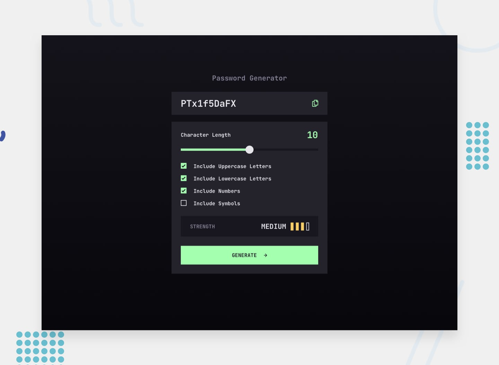

# Frontend Mentor - Password generator app

This is a solution to the [Password generator app challenge on Frontend Mentor](https://www.frontendmentor.io/challenges/password-generator-app-Mr8CLycqjh).

## Overview

### The challenge

#### Users should be able to:
1. Generate a password based on the selected inclusion options
2. Copy the generated password to the computer's clipboard
3. See a strength rating for their generated password
4. View the optimal layout for the interface depending on their device's screen size
5. See hover and focus states for all interactive elements on the page

### Links

- Solution URL: [Github Repository](https://github.com/yyunix/frontendmentor-solutions/tree/master/intermediate/password-generator-app)
- Live Site URL: [Password Generator](https://password-generator-yyunix36.vercel.app/)

## My process

### Built with

- [Next.js](https://nextjs.org/) - React framework
- [TypeScript](https://www.typescriptlang.org/) - TypeScript
- [TailwindCSS](https://tailwindcss.com/) - For styles

### User Stories - Features

#### Features for User Story #1
**1. Generate a password based on the selected inclusion options**
- A form with input range and checkboxes 
- input range: character length should be visible as user adjusts
- create a disabled input box to display the generated password
 
#### Features for User Story #2
**2. Copy the generated password to the computer's clipboard**
- use `navigator.clipboard.writeText` and store it in a state
- reset state after a few seconds

#### Features for User Story #3
**3. See a strength rating for their generated password**
- What's my strength rating system?
